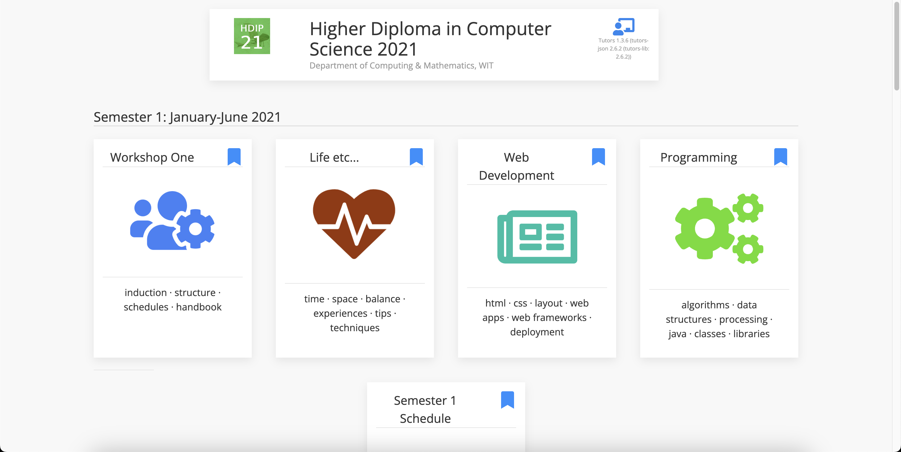
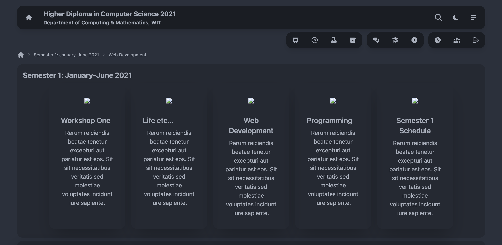

# The Tutors Project

A Final Report by Jordan Harrison

Higher Diploma in Computer Science

Department of Computing & Mathematics, SETU Waterford

20095937@mail.wit.ie / contact@jordanharrison.ie

# Table of Contents

- [The Tutors Project](#the-tutors-project)
- [Table of Contents](#table-of-contents)
- [Introduction](#introduction)
  - [Background](#background)
  - [Objectives](#objectives)
  - [Motivation](#motivation)
- [Getting on board](#getting-on-board)
  - [Initial Technologies \& User Experience](#initial-technologies--user-experience)
  - [Initial Setup \& Research](#initial-setup--research)
  - [Implementing DaisyUI](#implementing-daisyui)
- [Tutors Tech Team](#tutors-tech-team)
  - [Red Hat Onboarding](#red-hat-onboarding)
  - [Working with the Tutors Tech Team](#working-with-the-tutors-tech-team)
  - [A new Tutors domain \& branding](#a-new-tutors-domain--branding)
  - [Meeting Red Hat](#meeting-red-hat)
- [The Tutors Monorepo](#the-tutors-monorepo)
  - [Turborepo](#turborepo)
  - [Creating the Tutors Monorepo](#creating-the-tutors-monorepo)
  - [The Tutors Design System](#the-tutors-design-system)
- [Hacktoberfest 2022](#hacktoberfest-2022)
- [GDG Glasgow 2022](#gdg-glasgow-2022)
  - [SvelteKit](#sveltekit)
  - [An updated monorepo structure](#an-updated-monorepo-structure)
- [State of the Art](#state-of-the-art)
- [Tutors Architecture](#tutors-architecture)
- [The Tutors Open Source Infrastructure](#the-tutors-open-source-infrastructure)
- [Conclusion + Further work](#conclusion--further-work)

# Introduction

## Background

The Tutors Open Source Project is a collection of components & services supporting the creation of transformative learning experiences using open web standards. The project supports 3 complementary perspectives - the Learner, Educator & Developer experiences. It was originally developed by Eamonn de Leastar, beginning around 10 years ago as a python application with similar principles as it has today - ingesting markdown content to generate either a static site or a zip file which could be uploaded as a lab to Moodle. It has evolved over the past decade, keeping to the same principles, but has been adapted to use modern technologies.

In the summer of 2021, on the 3rd of June, I approached Eamonn De Leastar, a SETU lecturer and the developer of Tutors, with the intention of setting up the Tutors software on my local machine. My goal was to familiarize myself with the codebase and improve the user experience for learners. From that point on, I actively participated in the project, working on it consistently. Although it is unorthodox, I organically onboarded to the Tutors project early on in the course, and as a result grew as a developer because of Tutors and built something that I am proud of.

## Objectives

My objectives for this project were as follows:

1. Create a more engaging learner experience, with a fresh, modern interface & improved user experience.
2. Improve the developer experience by creating a monorepo and tidying up the codebase.
3. Open up the project to contributions from the open source developer community.
4. Bring exposure to the Tutors Open Source Project by presenting it to a wider audience.

## Motivation

In the first semester of my studies, I became a frequent user of Tutors, an educational software. As I used the software on a daily basis, I noticed that the user experience was lacking. Specifically, I found that the software did not have a self-explanatory interface and required users to seek explanations in order to navigate it. This realization motivated me to want to get involved with the project and work on the codebase in order to modernize the frontend design, with the goal of making Tutors more user-friendly for myself and others during the course of my studies. As I began to delve deeper into the project, I developed an acute appreciation for Tutors and became actively engaged in its development. This experience ultimately led me to choose Tutors as the subject of my final project.

# Getting on board

## Initial Technologies & User Experience

The initial frontend of Tutors when I started the course was built with Aurelia and used UI Kit for the design (see fig. 1). By the time I had started working on Tutors it had been upgraded to be built with Svelte and TailwindCSS (see fig. 2).

Figure 1 - Tutors Aurelia

Figure 2 - Tutors Svelte

## Initial Setup & Research

As a student early in my course of study, I had limited experience with frontend development. In order to familiarize myself with the codebase of the Tutors project, I dedicated multiple evenings to learning various tools and technologies such as Git, running code on a local machine, and navigating the codebase to understand its various components. I then conducted research on the tech stack being used, which included Svelte and TailwindCSS, and explored various UI libraries that could potentially improve the user experience when used in conjunction with these technologies. It was during this research that I discovered [Daisy UI](https://daisyui.com), an open-source UI component library built on top of TailwindCSS that provides a simplified approach to building User Interfaces through the use of pre-defined component classes.

## Implementing DaisyUI

After confirming that DaisyUI's component library would provide comprehensive coverage for all components needed in Tutors, I proceeded to implement the library in the project. The initial wireframe was created using a combination of TailwindCSS and DaisyUI via Stackblitz, an online code editor. The code for this stage of the project can be accessed [here](https://stackblitz.com/edit/daisyui-svelte-vite-cfhqdw?file=src/App.svelte).

During the implementation of DaisyUI I experimented with the colour styles, implemented the [theme-switch](https://github.com/saadeghi/theme-change) for dark mode & changing themes and the [iconify](https://icon-sets.iconify.design) package for icons. For a more comprehensive overview of my work on this phase of the project, I wrote a blog post which can be seen [here](https://jord.dev/a-summers-work-redesigning-wits-tutors-open-source-software-using-daisyui). In below figures 3 - 7 I have provided work in progress screenshots of this implementation.

Figure 3 - Tutors early wireframe with DaisyUI

Figure 4 - Tutors early wireframe - mobile responsiveness

Figure 5 - Early work in progress implementing DaisyUI in Tutors

Figure 6 - Mid work in progress implementing DaisyUI in Tutors

Figure 7 - Late work in progress implementing DaisyUI in Tutors

# Tutors Tech Team

## Red Hat Onboarding

In August 2021, following the successful build and release of Tutors incorporating DaisyUI, Eamonn De Leastar, the developer of Tutors, approached me with an invitation to join the Tutors technical team. At this point, Red Hat had agreed to provide resources for further development of Tutors, including the appointment of a project manager and two engineers to work on Tutors one day a week, with regular meetings to discuss progress on the project. I was excited to have the opportunity to continue contributing to the user experience of Tutors as part of this team.

## Working with the Tutors Tech Team

As part of the Tutors technical team, I worked on the following tasks:

- Creation of new 'Tutors' and 'Tutors Dark' theme with accessible colour schemes
- Creation of a dyslexia-friendly theme using the Open Dyslexic font and an easier to read colour scheme
- Implementation of the 'presence' feature and design a dropdown menu for the user's profile & show online status and number of users online
- Minor UI improvements to the Tutors interface such as a new menu bar style, coloured borders on cards, better mobile responsiveness and iconography changes

Figure 8 - Preview of the initial implementation of presence

## A new Tutors domain & branding

In addition to the work I did on the Tutors codebase, I also worked on the creation of a new domain for Tutors, [tutors.dev](https://tutors.dev). The domain was set up to be used alongside, and later replace, the existing Tutors instance on a netlify subdomain. This was done in order to provide a more user-friendly URL for learners to access Tutors and provide a more accessible sole location for the project, with subdomains for each component of the project.

I also worked on a rebrand of tutors with a new, custom logo I designed in Adobe Illustrator (see fig. 9). The logo was designed to be simple, modern and memorable, and to be used in conjunction with the new domain name.

Figure 9 - Tutors logo

## Meeting Red Hat

In April 2022 I had the opportunity to visit the Red Hat office in Waterford to attend a meeting with the Tutors technical team. During this meeting, we discussed the progress made on the project and the future of Tutors. The meeting was a great opportunity to meet the other members of the team and to discuss the project in person. I presented the UI changes made along with the new tutors logo & domain. I also presented the new themes I had created for Tutors, including the dyslexia-friendly theme. During the meeting, we also got the opportunity to do a [10-for-10](https://openpracticelibrary.com/practice/10-for-10/) brainstorming workshop. This was a great opportunity to discuss the future of Tutors and to get feedback from the team on the project.

## Netlify Open Source License

Wirh the new domain and branding in place, I worked with Eamonn to apply for a Netlify Open Source License. This license provided Tutors with a free Netlify account, which allows us to host the project on Netlify and to use additional Netlify's features such as multiple concurrent builds, a larger bandwidth allocation, multiple user access & continuous deployment. This was a great opportunity to provide Tutors with a more reliable hosting solution and to provide the project with a more professional look.

# The Tutors Monorepo

My next task was to create a monorepo for the Tutors project. This was done to create a single repository which developers can work in on all parts of the Tutors Open Source Project, instead of requiring them to pull multiple repositories to make changes. This provided a more streamlined development experience for contributors to the project. After a lot of research and consideration, I decided that the monorepo would be made using [Turborepo](https://turbo.build), a tool for managing monorepos.

## Turborepo

Turborepo is a tool for managing monorepos. It is a command line tool which allows developers to create a monorepo using a single command. The reason I decided to proceed with Turborepo over other monorepo tools such as [Lerna](https://lerna.js.org/) and [Yarn Workspaces](https://classic.yarnpkg.com/en/docs/workspaces/) is that is is built by a well-backed company (Vercel) and is actively maintained. It is very well documented and provides a lot of features out of the box, such as the ability to run scripts across multiple packages in the monorepo, and the ability to run scripts in parallel. It also provides a lot of flexibility in terms of how the monorepo is structured, which allowed be to to create a monorepo which suited the Tutors Project's needs.

## Creating the Tutors Monorepo

Before starting to create the monorepo, I had to decide on the structure of the monorepo. After considering this with Eamonn, we decided to structure the monorepo in the following way:

The root of the monorepo would contain the following folders:

- `apps` - this would contain all of the command line applications in the monorepo
- `components` - this would contain the reusable components of the monorepo
- `sites` - this would contain the frontend websites of the monorepo

This structure would allow us to create a monorepo which would be easy to navigate and would allow us to easily add new applications and components to the monorepo in the future. We wanted to get the monorepo up and running in a timely manner, to attract developers to the project during the Hacktoberfest 2022 event and to make sure that the monorepo was easy to navigate and understand for the new contributors that would come on board to the project.

## The Tutors Design System

Alongside the monorepo, I decided to put time into building out a design system for the Tutors project. This was done to provide a consistent user experience across all of the Tutors applications and to make it easier for developers to contribute to the project. Thus, the `tutors-ui` package was created. In order to fill out this package with components, I taken an [atomic design](https://bradfrost.com/blog/post/atomic-web-design/) approach to the design system. This approach involved breaking down the design system into smaller components, which could then be combined to create more complex components. This approach allowed for a more modular design system, which can be easily extended and modified in the future.

# Hacktoberfest 2022

# GDG Glasgow 2022

November 2022 - talk about tutors at GDG Glasgow

# SvelteKit & Skeleton

After the success we had during Hacktoberfest 2022, and with the looming new cohort of students coming in January to the HDip course, we decided to move ahead with building the next generation of Tutors. This was a complete rewrite of the Tutors project, using the latest technologies and best practices. The new version of Tutors was to be built using [SvelteKit](https://kit.svelte.dev/), a framework for building web applications using [Svelte](https://svelte.dev/), which is what the previous version of Tutors was built upon. This worked out very timely, as SvelteKit version 1.0 was released when we were starting to work on the new version of Tutors. This meant that we knew we were using a stable, production-ready and well supported framework for the new version of Tutors.

## SvelteKit

Due to my experience with Svelte, I was very excited to work on the new version of Tutors using SvelteKit. I had been following the development of SvelteKit for a while and was very excited to see it released. I had also been following the development of [Skeleton](https://skeleton.dev), a SvelteKit focused UI library. It was clear that SvelteKit was going to be a great fit for the new version of Tutors, being built on top of Svelte, and providing a lot of important new features, such as server-side rendering and a built in file-based routing system. It also provides a lot of flexibility in terms of how the application was structured, which allowed us to create a structure which suited the Tutors Project's needs.

Eamonn taken the liberty of doing the migration of the current designed Tutors Course Reader to SvelteKit. This was a great opportunity for me to get familiar with SvelteKit and to learn how to use it. I also got the opportunity to work on the new Tutors Course Reader design, which was to be done in Skeleton, and migrate more of the course reader into components in the tutors-ui library.

## Skeleton & tutors-ui components

## An updated monorepo structure

In order to facilitate the new version of Tutors, we decided to update the structure of the monorepo. The following was the updated folder structure that we decided on:

- `apps` - this contains all the front end applications in the monorepo
  - `course` - the course reader application built in SvelteKit
  - `home` - the home page of the Tutors project
  - `time` - the tutors time application built in SvelteKit
- `cli` - this contains all the command line applications in the monorepo
  - `tutors-gen` - a new generation tool for emitting json output of courses
  - `tutors-html` - the old html emitter for courses to output a static html website
  - `tutors-json` - the old json emitter for courses to output a json file
- `packages` - this contains all the reusable components of the monorepo
  - `tutors-lib` - the core library for the Tutors project
  - `tutors-reader-lib` - the core library for the Tutors Course Reader
  - `tutors-ui` - the design system for the Tutors project

# State of the Art

UX Design Systems & CSS Frameworks
Front End Frameworks
Build Systems
Open Source Patterns & infrastructure

# Tutors Architecture

Articulate the core of the system as presented on the Slides

# The Tutors Open Source Infrastructure

TODO

# Conclusion + Further work
